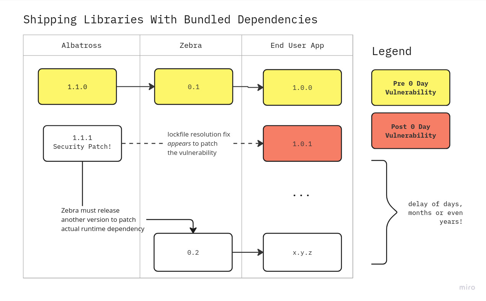
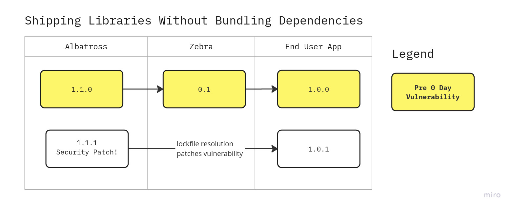

Some years ago, vite library mode and other bundling tools revolutionized the experience of shipping javascript & typescript modules for the browser. An unfortunate consequence, however, is that many libraries began shipping bundled with their dependencies.

Vite library mode and esbuild with `bundle: true` are great for shipping CDN bundle libraries (say for usage on unpkg, jsdelivr, etc), or for end-consuming apps that deploy somewhere, **where shipping with bundled dependencies is a desired feature**.

However, for esm modules on npm or other javascript package registries, this results in false positives regarding dependencies, and supply chain vulnerabilities, debugging issues, bundle size issues, and a loss of other patch improvements & flexibility for the end user.

Why? In short, because **your project lockfile is no longer the source of truth.**

## False Positives for (Most) Static Security Analysis Tools!

Starting with this because supply chain security comes before everything - shipping your library with bundled dependencies introduces huge potential for supply chain vulnerabilities. Unless you ship releases almost daily, by statically bundling versions, your users are always going to be essentially pinned to the installed version from your last release, and any security hotfixes upstream will be missed... but simple static analysis tools such as npm audit or similar will not be able to pick this up!

This is because your package manager (npm, pnpm, yarn, etc) will _think_ it's installing the patched version if there are ~ or ^ in the library's dependencies, but you are getting the wrong one.

### Hypothetical Toolchain Vulnerability Scenario

Last month, Jane maintainer shipped the ever popular `zebra` module, which depends on a module called `albatross`.

`zebra`'s `package.json` looks like this:

```json
{
  "name": "zebra",
  "version": "0.1",
  "dependencies": {
    "albatross": "^1.1.0"
  }
}
```

Last week, `albatross` project was contacted by Cure 53, who found an XSS attack vulnerability. `albatross` released a security patch as `albatross@1.1.1`.

However, Jane, the maintainer of `zebra` hasn't learned of this yet, because she is on a much needed vacation.

The users of `zebra` have learned of this vulnerability on 0 day, when renovatebot or dependabot or snyk or an npm install audit tells them that their lockfile contains vulnerabilities. They quickly re-release their internal software with a new lockfile resolution for `albatross@1.1.1`. problem solved, right?

_Unfortunately not._

The maintainer of `zebra`, Jane, is bundling dependencies with her module, and didn't think of this case (neither did I when we first shipped `@graphiql/react`!)

What does this mean? Let's look at this using the old `node_modules` pattern because it's easier to illustrate, though this would impact pnp users as well.

```text
./node_modules/
   /albatross/ <- albatross@1.1.1 is installed, but unused
   /zebra/ <- still bundled with & loading albatross@1.1.0 at runtime
```

This is an issue a dynamic security scan would catch, and perhaps more sophisticated static analysis tools, but most of the common off-the-shelf and freely available static analysis tools cannot.

And it is not a problem to be solved by security analysis tools, which should serve as a stopgap, because toolchain and maintainer best practices should be the first line of defense, and toolchain security is not the only reason this is an issue.

### Real World Implications

This has has real world implications for us, where our users had an outdated version of `markdown-it` which contained a security flaw. They had thought the problem was solved by updating their lockfile entry for `markdown-it` to the patch version, but our outdated inlined dependency for `@graphiql/react` was what they were actually using at runtime.

Yes, a maintainer can fix this by re-releasing the code, but this still invariably breaks the toolchain!

## 2. The Debugging/Sourcemaps Experience is **Whack**

Did you also notice this about two years ago? Suddenly it was much harder to trace buildtime (ts) and runtime bugs with dependencies because the code is entirely inlined?

First of all, modules can ship with their source and sourcemaps to help make this a little easier. Whether they should or not is a whole discussion.

The other issue is that, by providing false positive installs, you may actually be looking at the _wrong version_ of the library when debugging the downstream bug.

## 3. Duplicate Modules & Bundle Size!

This leads to duplicate module entries and increased bundle size as well. Not every bundler can detect the multiple inlined versions, so you will end up with bundles with duplicate versions of modules inlined into the same bundle! 

Or at best, with async imports, split chunks that are never loaded because one of the chunks contains most of the dependencies.

Note: Sometimes with tree splitting this is not an issue, results may vary.

## 4. User Flexibility is Lost

When inlining dependencies, your users will complain about the restriction because they are blocked from upstream improvements to your `dependencies`.

For example, historically `graphiql` allowed you to control the version of `codemirror`, because we used `^` resolution in `dependencies`, but now we bundle it with `@graphiql/react`, so users cannot upgrade to the latest patch or minor version of codemirror 5 until we upgrade it ourselves.

## How Library Maintainers Can Solve This Problem

Again, _you only need to avoid bundling dependencies when shipping libraries to NPM or other registries._ If your users want a browser-compatible cdn bundle, you can keep shipping that as, say, `mylibrary.bundle.js` for unpkg, but the `main` or `module` entry should point to a file that, whether transpiled by typescript or whatever tool or not, does not contain external library code

for `esbuild`: set `bundle: false`

for `vite` library mode, you can use [a plugin like this](https://socket.dev/npm/package/vite-plugin-no-bundle), or configure similar to the `webpack` example below

for `webpack`, you can set `externals` config like this:

```js
module.exports = {
  // ...
  // put everything inside package.json dependencies as externals
  externals: Object.keys(require("./package.json").dependencies).reduce(
    function (acc, cur) {
      acc[cur] = cur;
      return acc;
    },
    new Object()
  ),
  // ...
};
```

(from https://stackoverflow.com/a/71215365/1516887)

with plain `typescript`, you can even just use `tsc` cli, and configure your tsconfig.json as needed. You might need to target `modules` in a specific way depending on whether your library is browser facing, server facing, or universal. Make sure to enable sourcemaps and ship them. Similar can be achieved with babel CLI. This is one of the best approaches IMO, because having separate files and neat sourcemaps vastly improves the debugging experience.

### But I Need to Bundle Certain Dependencies Because of X Reason!

There may be reasons you need to bundle a dependency or three for your users. I highly suggest then using `bundleDependencies` option in `package.json`, which helps with some of these issues.

https://stackoverflow.com/a/25044361/1516887

### But My Users Need Libraries to be Browser/Runtime Compatible!

Of course - end consumers shipping webapps and services and other tools need to transpile & bundle their dependencies for whichever runtime they target.

In my opinion, *it should be up to your users to decide what bundling tool to use and what browsers to target*. All of the tools like esbuild, vite, swc, next.js, and others support bundling dependencies in various ways. We have incredibly fast build tools now, so use them to their full advantage!

- `esbuild` bundles dependencies with `build: true`
- `vite` bundles dependencies automatically
- with `webpack`, if they have `exclude: /node_modules/` they should remove it. it's 2023!
- `next.js@13` still ships with webpack 5, but enabling this is as easy as enabling [`transpilePackages`](https://nextjs.org/docs/app/api-reference/next-config-js/transpilePackages). I would assume this setting works with their turbopack implementation as well.


### Is This A Major Risk? Is My Project that Uses X or Y or Z Library Vulnerable?

That's up to you to determine. This is a known issue amongst advanced javascript and typescript users. This should not be bombshell news to anyone.

In order to know for certain, you would take the alert from your security tool, and instead of just accepting the PR to fix your lockfile, you would inspect the parent dependency you rely on to ensure that

I'm available for hire, or any other javascript/typescript informed security analyst may be able to help you if you want to know for sure, but some static and/or dynamic security analysis tools may be able to help you, in some cases.
