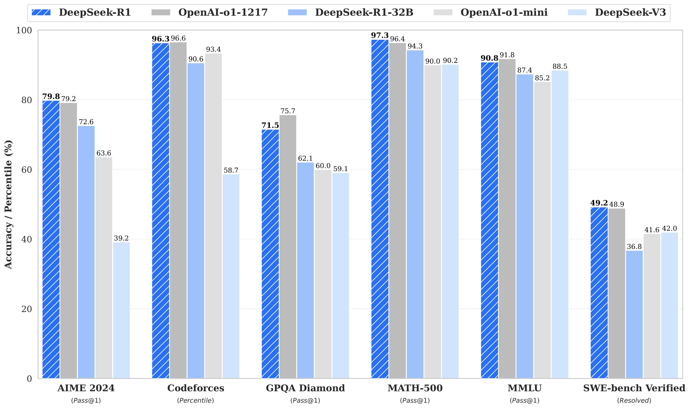

# Running DeepSeek-R1 and Other Open Source LLMs Locally or With Managed Providers

DeepSeek-R1 is a powerful open source LLM that can run on consumer hardware. In this guide, I'll walk through setting up DeepSeek-R1 (and by extension, other open source LLMs) using various providers and interfaces. I'll also cover integrating these setups with Cline for agentic coding.

## LLMStudio + OpenWebUI

LLMStudio provides an excellent interface for running models locally. Here's how to get started:

1. Download and install LLMStudio from their [official website](https://lmstudio.ai)
2. Launch LLMStudio and navigate to the Models tab
3. Search for "deepseek" and download DeepSeek-R1 (choose the quantized version that matches your hardware)
4. Once downloaded, click "Run" on the model
5. In a separate terminal, install OpenWebUI:
   ```bash
   docker run -d --name openwebui \
     -p 8080:8080 \
     -v $HOME/.cache/openwebui:/data \
     --add-host=host.docker.internal:host-gateway \
     --restart unless-stopped \
     ghcr.io/open-webui/open-webui:main
   ```
6. Access OpenWebUI at http://localhost:8080
7. Add a new model endpoint in OpenWebUI:
   - Name: DeepSeek-R1
   - API Type: OpenAI
   - Base URL: http://localhost:1234/v1 (or whatever port LLMStudio is using)
   - API Key: (leave blank)

## Ollama + OpenWebUI

Ollama offers a simpler setup process:

1. Install Ollama:
   ```bash
   curl -fsSL https://ollama.com/install.sh | sh
   ```
2. Pull and run DeepSeek-R1:
   ```bash
   ollama pull deepseek-r1:70b
   ollama serve
   ```
3. Install OpenWebUI as shown above
4. In OpenWebUI, add a new model endpoint:
   - Name: DeepSeek-R1
   - API Type: Ollama
   - Base URL: http://localhost:11434
   - Model: deepseek

Personally I perfer Ollama because it's easier to get started and works like docker CLI, however LLMStudio provides much more observability for running models locally, and is preferrable for users who want a GUI experience for managing/introspecting models.

## Together + OpenWebUI

Together.ai provides cloud hosting for various open source models:

1. Sign up for an account at [together.ai](https://together.ai)
2. Get your API key from the dashboard
3. Install OpenWebUI as shown above
4. In OpenWebUI, add a new model endpoint:
   - Name: DeepSeek-R1
   - API Type: Together
   - Base URL: https://api.together.xyz
   - API Key: (your Together API key)
   - Model: deepseek-coder


## Setting Up Cline

[Cline](https://github.com/rikhuijzer/cline) is a powerful tool for agentic coding. Here's how to configure it with the above providers:

### LLMStudio Configuration

Add to your Cline config:
```json
{
  "model": "deepseek",
  "baseUrl": "http://localhost:1234/v1",
  "apiKey": ""
}
```

### Ollama Configuration

```json
{
  "model": "deepseek",
  "baseUrl": "http://localhost:11434",
  "provider": "ollama"
}
```

### Together Configuration

```json
{
  "model": "deepseek-coder",
  "baseUrl": "https://api.together.xyz/v1",
  "apiKey": "your-together-api-key",
  "provider": "together"
}
```

## Understanding DeepSeek's Training Approach

DeepSeek-R1 takes a unique approach to model training compared to models from Anthropic (Claude) and OpenAI (GPT). Here's a breakdown of the key differences:

### DeepSeek's Approach
- Uses Direct Preference Optimization (DPO), a more efficient form of reinforcement learning
- Directly learns from human preferences without complex reward modeling
- Requires less compute for alignment while maintaining high performance
- Open source approach allows for community verification and improvement
- Training data focused heavily on coding and technical content

### Anthropic and OpenAI's Approach
- Uses Constitutional AI (Anthropic) and Reinforcement Learning from Human Feedback (OpenAI)
- More complex reward modeling process
- Requires significant compute resources for alignment
- Closed source training methodology
- Broader training data covering more domains

The practical implications of these differences are:
1. DeepSeek-R1 excels at coding tasks due to its focused training
2. More efficient training allows for faster model iterations
3. Open source nature enables community-driven improvements
4. Lower compute requirements make it more practical to run locally

## Important Note: Model Size Matters!

When pulling/configuring the models, note that the `deepseek-r1-70b` model is the one that stacks up best against openai and others.
Without lots of VRAM or specialized hardware, it might be slow to run locally, albeit powerful.  As you can see, the 32b model also stacks up relatively well, for something you can run for free.



If you find you need 70b and your hardware is too slow, consider together or other hosted platforms that support deepseek's model.

## Performance Considerations

When running models locally, consider:

1. GPU Memory Requirements:
   - DeepSeek-R1 7B: ~8GB VRAM
   - DeepSeek-R1 13B: ~14GB VRAM
   - Use quantized versions for lower memory usage

2. CPU-Only Operation:
   - Possible but significantly slower
   - Consider cloud options if local GPU isn't available

3. Cloud Tradeoffs:
   - Together/Cohere: Higher latency but no hardware requirements
   - Local: Lower latency but needs capable hardware

## Conclusion

Whether you choose to run DeepSeek-R1 locally or in the cloud, OpenWebUI provides a consistent interface across all providers. For development work, I recommend starting with Ollama for its simplicity, then moving to Together or Cohere if you need more compute power than your local machine can provide.

Remember to monitor your API usage when using cloud providers, as costs can add up quickly during heavy development sessions. Local setups, while requiring more powerful hardware, can be more cost-effective for long-term use.
